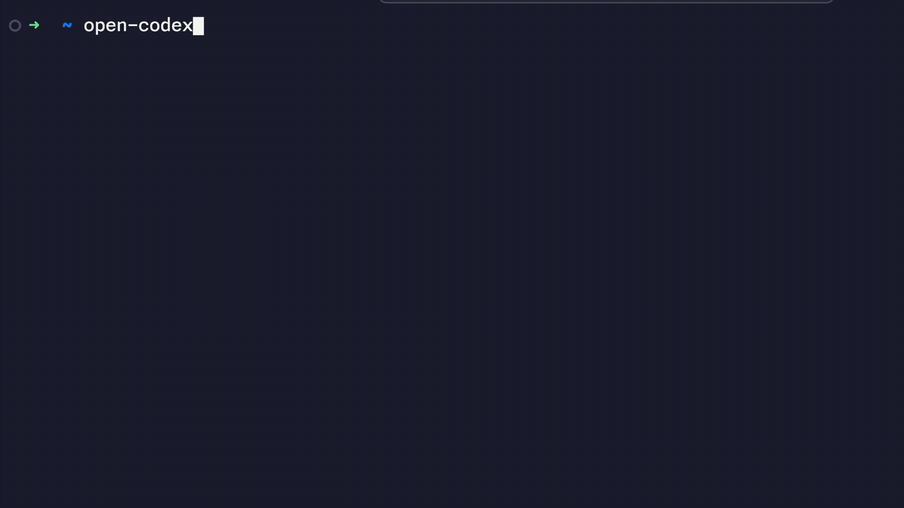

# Open Codex

<h1 align="center">Open Codex CLI</h1>
<p align="center">Lightweight coding agent that runs in your terminal</p>
<p align="center"><code>
brew install brew tap codingmoh/open-codex
brew install open-codex
</code></p>



---

**Open Codex** is a fully open-source command-line AI assistant inspired by OpenAI Codex, supporting local language models like `phi-4-mini`.

No API key is required. Everything runs locally.

Supports:
- **One-shot mode**: `open-codex "list all folders"` -> returns shell command
- 🧠 Local-only execution using supported OS models (currently `phi-4-mini`)

---
## ✨ Features

- Natural Language to Shell Command (via local models)
- Works on macOS, Linux, and Windows (Python-based)
- Confirmation before execution
- Add to clipboard / abort / execute prompt
- One-shot interaction mode (interactive and function-calling coming soon)
- Colored terminal output for better readability

---

## 🧱 Future Plans

- Interactive, context aware mode
- Fancy TUI with `textual` or `rich`
- Add support for additional OSS Models
- Full interactive chat mode
- Function-calling support
- Voice input via Whisper
- Command history and undo
- Plugin system for workflows

---


## 📦 Installation


### 🔹 Option 1: Install via Homebrew (Recommended for MacOS)

```bash
brew tap codingmoh/open-codex
brew install open-codex
```


### 🔹 Option 2: Install via pipx (cross-platform)

```bash
pipx install open-codex
```

### 🔹 Option 3: Clone & Install locally

```bash
git clone https://github.com/codingmoh/open-codex.git
cd open_codex
pip install .
```


Once installed, you can use the `open-codex` CLI globally.

---

## 🚀 Usage

### One-shot mode

```bash
open-codex "untar file abc.tar"
```

✅ Codex suggests a shell command  
✅ Asks for confirmation / add to clipboard / abort  
✅ Executes if approved

---

## 🛡️ Security Notice

All models run locally. Commands are only executed after explicit approval.

---

## 🧑‍💻 Contributing

PRs welcome! Ideas, issues, improvements — all appreciated.

---

## 📝 License

MIT

---

❤️ Built with love and caffeine by [codingmoh](https://github.com/codingmoh).

